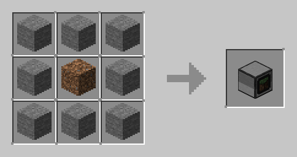

# Blockator - Visual Programming Block for Minecraft

## Overview
Blockator is a Minecraft mod that introduces a programmable block that integrates with the [CC: Tweaked](https://modrinth.com/mod/cc-tweaked) mod. This block provides a **visual programming interface**, allowing users to create complex logic and automation without writing traditional Lua code.

## Features
- **Visual Programming Interface**: Easily create and modify scripts using a block-based drag-and-drop editor.
<!--- **CC: Tweaked Integration**: Communicate with turtles, computers, and other peripherals from the CC: Tweaked mod.-->
- **Customizable Functions**: Create loops, conditionals, and other logic structures without coding experience.
- **User-Friendly UI**: Simple interface for beginners and powerful enough for experienced programmers.
<!--- **Multiplayer Support**: Use Blockator in both singleplayer and multiplayer environments.-->

## Installation
### Requirements:
- Minecraft **NeoForge 1.21.1-21.1.65**
- NeoForge 21.1.65 ([https://files.minecraftforge.net/](https://maven.neoforged.net/releases/net/neoforged/neoforge/21.1.65/neoforge-21.1.65-installer.jar)) 
- [CC: Tweaked](https://modrinth.com/mod/cc-tweaked)

### Steps:
1. Download the latest Blockator `.jar` file.
2. Place the file in the `mods` folder of your Minecraft installation.
3. Launch Minecraft and ensure both **Blockator** and **CC: Tweaked** are active in the mod list.
4. Start a world and craft the **Blockator Block** to begin programming!

## How to Use
1. **Craft the Blockator**
   - Recipe:
   - 
   - |Stone|Stone|Stone|
   - |Stone|Dirt|Stone|
   - |Stone|Stone|Stone|
2. **Place the Block**
   - Right-click to open the visual programming interface.
3. **Create Programs**
   - Drag and drop blocks to build your program.
4. **Run & Debug**
   - Click the Save button to save your program to the turtle with id set above.
   - In the turtle run the command **generated**.

<!-- ## Compatibility
- Fully compatible with **CC: Tweaked computers and peripherals**.
- Works in both **singleplayer and multiplayer servers**.) -->

## Limitations 
### MCreator
I created this mod with very little knowledge of java knwoledge, that is, I used the MCreator tool to do it.
- **Not a new turtle.**
  Since the blockator generates a script in the CC: Tweaked turtle, some scripts do not work as expected, for example the Say block does not print the text in the game chat, but instead prints it in the turtle console.
- **Text input cannot appear in GUI.**
  Another limitation is that name blocks, i.e. item, string and variable blocks, cannot be named in the blockator GUI. In the case of an item, you just put it in the GUI as if it were a programming block. In the other cases, you have to take the programming blocks to an anvil and rename them. The same thing happens with numbers, but instead of naming them, the number they represent depends on the quantity in a slot.
  

## Issues & Feedback
If you encounter any bugs or have suggestions, please report them on our [GitHub Issues](https://github.com/Mamogammg/minecraft-blockator/issues) page.

---
Enjoy Blockator and happy coding! 🎮💻
